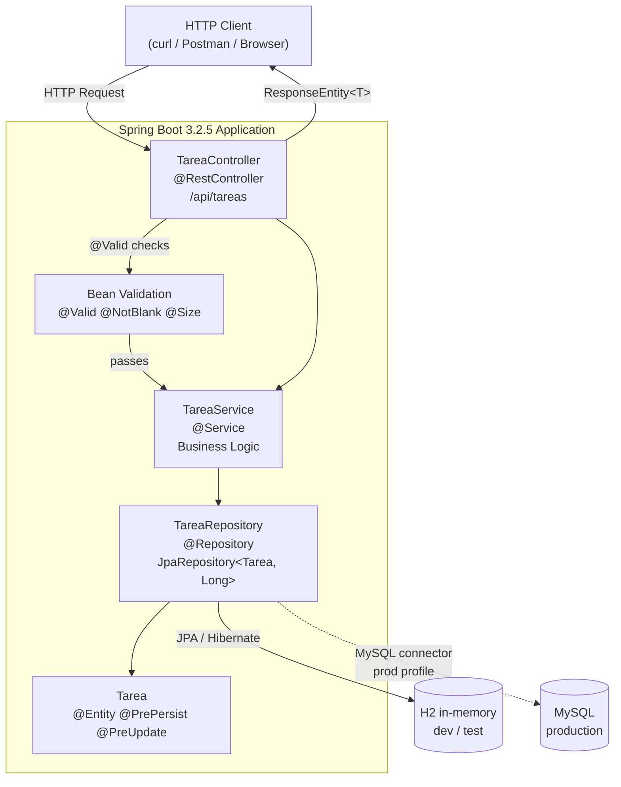
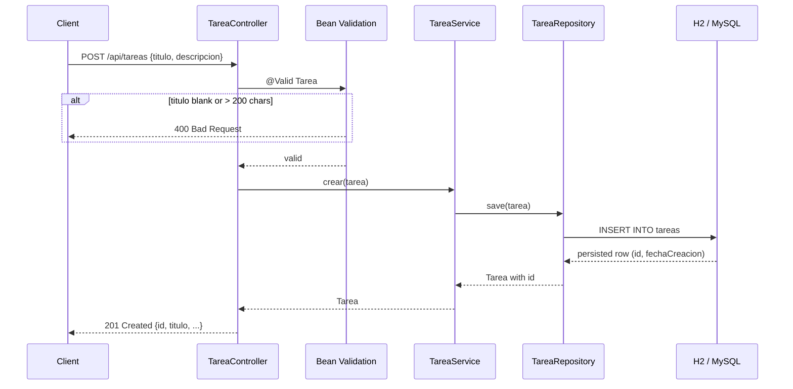

# API REST de Gestión de Tareas — Spring Boot 3.2.5 / Java 17

A **Java 17 Spring Boot 3.2.5 REST API** that provides full CRUD management of tasks (tareas), including creation, retrieval, update, deletion, and filtering by completion status, backed by an in-memory H2 database (dev/test) or MySQL (production).

---

## Endpoints Implemented

### `GET /api/tareas`
Returns the complete list of tasks. Always responds with `200 OK` and a JSON array (empty if no tasks exist).

### `GET /api/tareas/{id}`
Returns a single task by its numeric ID. Responds `200 OK` with the task body or `404 Not Found` if the ID does not exist.

### `GET /api/tareas/estado/{completada}`
Filters tasks by completion status. Pass `true` to retrieve completed tasks or `false` for pending ones. Responds `200 OK` with a (possibly empty) array.

### `POST /api/tareas`
Creates a new task. Requires a JSON body with at least `titulo` (max 200 chars). `descripcion` is optional (max 1000 chars). `completada` defaults to `false`. Responds `201 Created` with the persisted entity including auto-generated `id`, `fechaCreacion`, and `fechaActualizacion`.  
Responds `400 Bad Request` if `titulo` is blank or validation fails.

### `PUT /api/tareas/{id}`
Replaces a task's `titulo`, `descripcion`, and `completada` fields. Responds `200 OK` with the updated task or `404 Not Found` if the ID does not exist.

### `DELETE /api/tareas/{id}`
Deletes a task by ID. Responds `204 No Content` on success or `404 Not Found` if the ID does not exist.

---

## Project Structure

```
api-tareas/
├── src/main/java/com/tareas/api/
│   ├── ApiTareasApplication.java          — Spring Boot entry point
│   ├── model/
│   │   └── Tarea.java                     — JPA entity with validation constraints and lifecycle hooks
│   ├── repository/
│   │   └── TareaRepository.java           — JpaRepository with custom findByCompletada query
│   ├── service/
│   │   └── TareaService.java              — Business logic layer, orchestrates repository calls
│   └── controller/
│       └── TareaController.java           — REST controller, maps HTTP verbs to service methods
├── src/main/resources/
│   ├── application.properties             — H2 datasource config and JPA settings
│   └── schema.sql                         — DDL for the tareas table
├── src/test/java/com/tareas/api/
│   ├── ApiTareasApplicationTests.java     — Context load smoke test
│   └── TareaIntegrationTest.java          — Full integration tests covering all endpoints
├── pom.xml                                — Maven build descriptor (Spring Boot parent 3.2.5)
└── .gitlab-ci.yml                         — GitLab CI pipeline: build stage with Maven
```

---

## Design Patterns / Architecture

- **Layered Architecture (MVC)** — strict separation between `Controller` → `Service` → `Repository`, enforced by Spring's component stereotype annotations (`@RestController`, `@Service`, `@Repository`).
- **Repository Pattern** — `TareaRepository` extends `JpaRepository<Tarea, Long>`, abstracting all persistence operations. The custom method `findByCompletada(boolean)` is resolved by Spring Data JPA from the method name, requiring no additional SQL.
- **Dependency Injection (Constructor Injection)** — both `TareaController` and `TareaService` receive their dependencies via constructor, making them easily testable and keeping coupling explicit.
- **JPA Lifecycle Callbacks** — `@PrePersist` and `@PreUpdate` on the `Tarea` entity automatically populate `fechaCreacion` and `fechaActualizacion` without requiring service-layer intervention.

---

## Architecture

### Component Diagram



### Request Flow — POST /api/tareas



---

## Decisions

### Decision 1 — H2 in-memory for dev/test, MySQL connector for production

**Decision:** Use H2 (`spring.datasource.url=jdbc:h2:mem:tareasdb`) as the default datasource and include `mysql-connector-j` as a runtime dependency for production profiles.

**Alternatives considered:** Use a single MySQL instance for all environments (local + CI), or use Testcontainers to spin up a real MySQL for integration tests.

**Reason:** H2 requires zero external setup — any developer can clone the repo and run `./mvnw test` without installing or configuring a database server. The 13 integration tests start and complete in under 40 seconds against H2.

**Trade-off accepted:** Tests run against H2's SQL dialect rather than MySQL's, so dialect-specific bugs could be hidden. Accepted because the query surface is small: only `findAll`, `findById`, `findByCompletada`, `save`, `deleteById` — none use DB-specific syntax.

---

### Decision 2 — Spring Data derived query (`findByCompletada`) instead of `@Query`

**Decision:** Declare `List<Tarea> findByCompletada(boolean completada)` in `TareaRepository` and let Spring Data JPA generate the SQL from the method name.

**Alternatives considered:** Write an explicit JPQL query with `@Query("SELECT t FROM Tarea t WHERE t.completada = :completada")`, or use `JpaSpecificationExecutor` for dynamic filtering.

**Reason:** The filter is a simple equality check on a single boolean field. Derived queries require zero boilerplate: the method name IS the specification. Adding `@Query` for this case would be noise without benefit.

**Trade-off accepted:** Derived queries are harder to use for complex predicates (joins, OR clauses, dynamic filters). If more filter criteria are added later, a `Specification` or `@Query` approach would need to replace this.

---

### Decision 3 — Integration tests only, no unit tests with mocks

**Decision:** Write `TareaIntegrationTest` with `@SpringBootTest(webEnvironment = RANDOM_PORT)` and `TestRestTemplate`, covering all 12 endpoint scenarios end-to-end. No separate unit tests with mocked repositories.

**Alternatives considered:** Unit-test each layer in isolation — mock `TareaRepository` in `TareaService` tests, mock `TareaService` in `TareaController` tests using Mockito.

**Reason:** The service and controller layers are thin orchestrators with no complex branching logic. An integration test that calls the real HTTP endpoint catches the full stack (serialization, validation, JPA lifecycle, HTTP status codes) in a single assertion. Mocking would duplicate verification effort without adding confidence.

**Trade-off accepted:** Integration tests are slower per test (~3s each vs ~100ms for unit tests) and require Spring context startup (~8s). Also, a failure in any layer is harder to pinpoint than in a focused unit test. Accepted for this scope; adding unit tests would be the next step as business logic grows.

---

## AI-Assisted Development

This project was scaffolded with **claude-sonnet-4-6** (Claude Code CLI) in a single session on 2026-04-20.

### What was AI-generated

All Java source files (`TareaController`, `TareaService`, `TareaRepository`, `Tarea`, `ApiTareasApplication`), `pom.xml`, `application.properties`, `schema.sql`, `.gitlab-ci.yml`, and the 13 integration tests in `TareaIntegrationTest.java` were generated by the AI agent. The Postman collection (`api_tareas_spring-boot.postman_collection.json`) was generated in a follow-up session on 2026-05-26.

### Developer review and validation

1. **Test execution verification** — All 13 integration tests were executed locally (`./mvnw test`) and confirmed passing (13/13, 0 failures, BUILD SUCCESS) before the initial commit. Output reviewed line by line in the terminal.
2. **GitLab CI gap identified** — The generated `.gitlab-ci.yml` used `-DskipTests` in the build stage, meaning tests were not validated in CI. This was identified as a compliance gap and tracked in `docs/compliance/compliance_report.md` for remediation.
3. **Architecture review** — The layered architecture (Controller → Service → Repository), constructor injection pattern, and JPA lifecycle callbacks (`@PrePersist`, `@PreUpdate`) were verified against Spring Boot best practices and project Java rules before acceptance.
4. **Checkstyle violation fix** — After configuring the Checkstyle linter (2026-06-26), one line-length violation was found in `Tarea.java:69` (setter method 121 chars > 120 char limit) and fixed by splitting into multi-line format.

### What was not changed

The CRUD logic, validation constraints, and test coverage were accepted as-is because the integration test suite provides a high-confidence safety net — all endpoints, success cases, and error cases are verified end-to-end.

---

## How It Works

Incoming HTTP requests hit `TareaController`, which delegates to `TareaService` for business logic. `TareaService` calls `TareaRepository` (Spring Data JPA) to interact with the database, and the result is returned up the chain as a `ResponseEntity`. Bean Validation (`@NotBlank`, `@Size`) is enforced automatically by Spring before the controller method body executes.

```java
// Create a task — POST /api/tareas
Tarea tarea = new Tarea("Comprar leche", "Ir al supermercado");

ResponseEntity<Tarea> response = restTemplate.postForEntity(
        "/api/tareas", tarea, Tarea.class);

// Response: 201 Created
// Body: { "id": 1, "titulo": "Comprar leche", "descripcion": "Ir al supermercado",
//          "completada": false, "fechaCreacion": "2026-05-20T10:00:00", ... }
```

---

## Getting Started

### Prerequisites
- **Java 17** (JDK)
- **Maven 3.8+** (or use the included `mvnw` wrapper)

### Clone

```bash
# GitHub
git clone https://github.com/Jorgeaapaz/MISEIA_1-4-10-api-spring-boot-tareas.git

# GitLab
git clone https://gitlab.codecrypto.academy/jorgeaapaz/MISEIA_1-4-10-api-spring-boot-tareas.git

cd MISEIA_1-4-10-api-spring-boot-tareas
```

### Configuration (Environment Variables)

The app runs with H2 in-memory by default — no configuration needed for development.

For production (MySQL), copy `.env.example` to `.env` and fill in your values:

```bash
cp .env.example .env
# Edit .env: set SPRING_DATASOURCE_URL, SPRING_DATASOURCE_USERNAME, etc.
```

Spring Boot reads these automatically as property overrides. Key variables:

| Variable | Default | Description |
|----------|---------|-------------|
| `SPRING_PROFILES_ACTIVE` | `default` (H2) | Set to `prod` for MySQL |
| `SPRING_DATASOURCE_URL` | H2 in-memory | MySQL JDBC URL for production |
| `SPRING_DATASOURCE_USERNAME` | `sa` | Database username |
| `SPRING_DATASOURCE_PASSWORD` | *(empty)* | Database password |
| `SERVER_PORT` | `8080` | HTTP port |

### Test Coverage

```bash
# Run tests with coverage report
./mvnw verify

# Open coverage report
open target/site/jacoco/index.html
```

Coverage threshold: **60% line coverage** (enforced by JaCoCo — build fails if below threshold).

### Build & Run

```bash
# Run tests
./mvnw test

# Run tests + linter + coverage report
./mvnw verify

# Start the application (H2 in-memory, dev mode)
./mvnw spring-boot:run
```

The API is available at `http://localhost:8080/api/tareas`.  
H2 console (dev only): `http://localhost:8080/h2-console` — JDBC URL: `jdbc:h2:mem:tareasdb`, user: `sa`, password: *(empty)*.

---

## Deployment

### Public URL

The API is deployed and accessible at:

**https://api-tareas.deviaaps.com/api/tareas**

```bash
# Verify the deployment is live
curl https://api-tareas.deviaaps.com/api/tareas
# Expected: 200 OK  []
```

### CI/CD Badge

[](https://github.com/Jorgeaapaz/MISEIA_1-4-10-api-spring-boot-tareas/actions/workflows/ci-cd.yml)

### Architecture

| Layer | Technology |
|-------|-----------|
| Cloud | GCP VM `ubuntu-vm-docker28` (`us-south1-c`) |
| Container runtime | Docker 28 |
| Reverse proxy / TLS | Traefik v3.3, wildcard cert `*.deviaaps.com` (Let's Encrypt) |
| App | Spring Boot JAR in `eclipse-temurin:17-jre-alpine` container |
| Network | `miseia-net` Docker bridge (shared with Traefik and other services) |
| External port | `30001` → container port `8080` |

### Automated Deployment (GitHub Actions)

Every push to `master` triggers `.github/workflows/ci-cd.yml`:

1. **test** — `./mvnw test` (13 integration tests)
2. **lint** — `./mvnw checkstyle:check`
3. **coverage** — `./mvnw verify` + upload JaCoCo report artifact
4. **build** — `./mvnw clean package` → uploads JAR artifact
5. **deploy** — SCP files to VM + `docker build && docker compose up -d`

The deploy job only runs on push to `master`, not on pull requests.

### Manual Deployment

```bash
# 1. Build JAR
./mvnw clean package -DskipTests

# 2. Copy to VM
scp -i C:\ubuntuiso\.ssh\vboxuser \
  target/api-tareas-1.0.0.jar Dockerfile docker-compose.yml \
  gcvmuser@34.174.56.186:~/MISEIA1-4-10_api-spring-boot-tareas/

# 3. Deploy on VM
ssh -i C:\ubuntuiso\.ssh\vboxuser gcvmuser@34.174.56.186 "
  cd ~/MISEIA1-4-10_api-spring-boot-tareas &&
  docker build -t api-tareas:latest . &&
  docker compose down --remove-orphans || true &&
  docker compose up -d
"

# 4. Verify
curl https://api-tareas.deviaaps.com/api/tareas
```

---

## Example Output

### Success — Create a task

```http
POST /api/tareas
Content-Type: application/json

{ "titulo": "Comprar leche", "descripcion": "Ir al supermercado" }
```

```http
HTTP/1.1 201 Created
Content-Type: application/json

{
  "id": 1,
  "titulo": "Comprar leche",
  "descripcion": "Ir al supermercado",
  "completada": false,
  "fechaCreacion": "2026-05-20T10:00:00",
  "fechaActualizacion": "2026-05-20T10:00:00"
}
```

### Success — Filter by status (completed only)

```http
GET /api/tareas/estado/true
```

```http
HTTP/1.1 200 OK

[
  {
    "id": 3,
    "titulo": "Completada",
    "descripcion": "Desc",
    "completada": true,
    "fechaCreacion": "2026-05-20T09:00:00",
    "fechaActualizacion": "2026-05-20T09:30:00"
  }
]
```

### Failure — Missing title (validation error)

```http
POST /api/tareas
Content-Type: application/json

{ "descripcion": "Sin título" }
```

```http
HTTP/1.1 400 Bad Request
```

### Failure — Task not found

```http
GET /api/tareas/9999
```

```http
HTTP/1.1 404 Not Found
```

### Success — Delete a task

```http
DELETE /api/tareas/1
```

```http
HTTP/1.1 204 No Content
```
